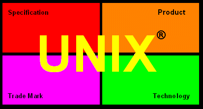
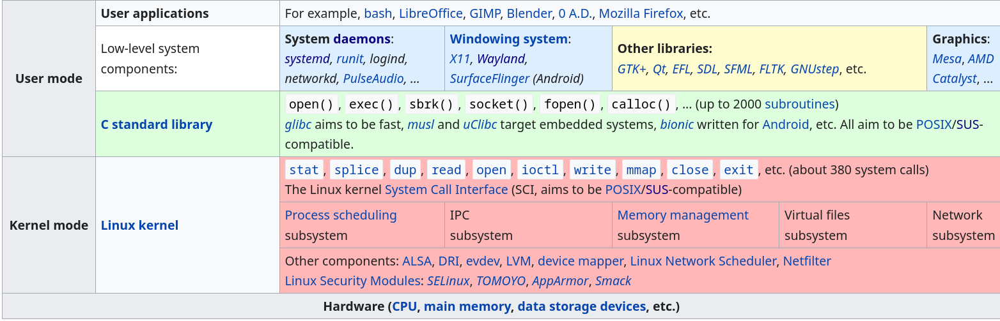
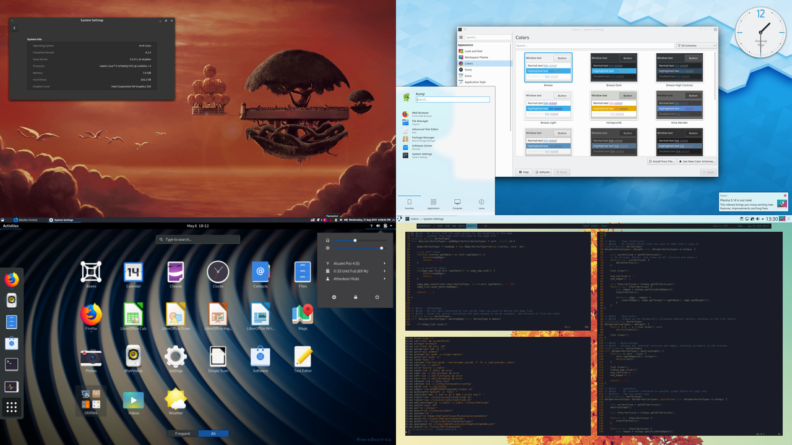
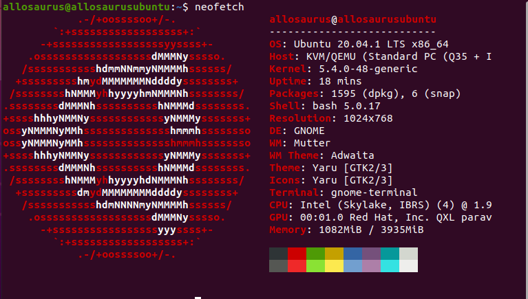

# 第一部分 - 认识Linux
>  *这是大题的**第一部分**。*
>
>  *请**仔细**阅读完每一章节中的文章后，按照内容指示、依据自身知识、参阅相关文档等，回答问题。*
>
>  本部分问题除了 **1-8** 外都是***简答题***。

## Chapter 1:  A brief history into Unix, FOSS and Linux

### Unix的诞生

> *The UNIX operating system has been a product with four elements; the specification (e.g. SVID) , the technology (e.g. SVR4), the registered trade mark (UNIX), and the product (e.g. UNIXWare).*

#### 阅读

​	1969年的某一天在贝尔实验室 (Bell Labs) ，一个划时代的系统就这么诞生了，它被命名为 **Unix** ， 取其不同于不尽理想的操作系统 **Multics** 之意（事实上，Multics 于 2000 年才正式宣告死亡，但不是我们今天的主题，详情请参阅[这里](https://www.multicians.org/myths.html#fail69)），十年后，Unix 第七版 (Version 7 Unix) 成为了所有往后开发的所有 Unix 的祖宗。

​	那么 Unix （指 Version 7 后，下同）究竟有什么特点让它别于当时其他的操作系统呢？

* 在 Unix 模型中，操作系统的定义为：一大堆的***程序 (programs)*** 与跑程序的***内核 (kernel)*** 。
* 以纯文本方式存取数据。
* 几乎整个系统以 C 编写，***可移植性 (portability)*** 高，不受硬件平台限制。
* 将***装置 (device)*** 和一些***进程间通信 (IPC)*** 当成文件。
* 程序可经***管道 (pipes)*** 互相通信。

​	在 Unix 文化中，还有所谓的 **Unix 哲学**：

* 让程序只做一件事做到好。

* 让程序能一起使用。

* 让程序能处理文本，因为文本处处通用。

​	下图涵盖了整个 Unix 的设计理念和哲学：  

​	正是因为 Unix 简单明了的特色，随后，Unix 被用在各种领域上，包含计算机辅助设计、工业生产控制、实验模拟、学术研究、甚至是互联网，有了 Unix ，一切的一切都被赋予了鲜活的生命，没有 Unix ，可能就没有今日发达的信息技术。

#### 问题

##### 1-1

​	为什么操作系统以 C 编写的话，可移植性会比较高呢？

> ***Hint:*** 可参考有关CPU架构和编译的相关文档。

##### 1-2

​	依上文所叙述的特色，比较 Unix 与你熟悉的操作系统（如：Windows ）有哪些相同或不同之处？

##### 1-3

​	你支持 Unix 哲学吗？你认为这套理论在目前程序开发上是否还适用？并说明你的理由。

### GNU 和 FOSS

#### 阅读

​	当 Unix 的开发到了 70 年代末期，AT&T （贝尔实验室隶属的公司）许可了一些实验室外的其他组织也能开发 Unix ，此时各种 Unix 变种可说是百花齐放，首先是由 UC Berkeley 开发的 BSD Unix（想更了解 BSD？参阅 [这里](https://www.freebsd.org/doc/en_US.ISO8859-1/articles/explaining-bsd/) ）外，还有 Sun 的 SunOS/Solaris 及微软的 Xenix 等。不过多数的 Unix 变种为商业用途或无法获取源码，而这种情形是 FSF (Free Software Foundation) 不乐见的。  

​[FSF](https://www.fsf.org/about/) 是何许人也？简单来说，这是一个致力于提倡开源和自由软件的组织，那什么又是开源和自由软件？我们先来看看第一个词：开源，顾名思义，就是开放程序的代码提供大家修改，但许多人所不知道的是，开源的代码也是有许可证的（你是否留意过？~~不管你有没有，这都是问题1-5 :)~~ ）因此用户在使用、修改、二次开发部分开源软件时，同时也会受到限制，而 OSI (Open Source Initiative) 将开源定义如下：

* 自由分发原软件：许可证不得限制用户分发或分享原本的软件，也不得向使用者征收版权税等。
* 包含源代码：程序需包含用户方便修改的源代码，刻意混淆或不全的源码是不允许的。
* 允许二次开发或衍生作品：许可证须允许用户可以修改及二次开发原本的软件，且必须让他们以同样的许可证发布软件。
* 不得歧视个人或群体，限制使用领域。
* ......

​	而自由 (free) 软件则是由 FSF 觉得部分开源许可证的限制太多而提出的概念，并不是纯粹指免费而已，事实上，开源软件与自由软件的差异并不大，大多数的软件既是开源软件也是自由软件（有关 FSF 对自由软件的定义可查阅[这里](https://www.gnu.org/philosophy/free-sw.html)）。
​	话题再回到 Unix 身上，也就是说，当时大部分的 Unix 变种都是非开源、闭源的，于是 FSF 想出了一个操作系统：**GNU**！  

​	GNU 是 "GNU is Not Unix" 的递归缩写，从名字我们可以得知 GNU 并非起源于 Unix ，而是一个全新的系统，但它的主要目标是要能兼容 Unix ，我们称这种系统为 *Unix-like* ，也就是虽然不是 Unix ，系统中的程序都是重新写过的，但与 Unix 非常相似。GNU 完全开源 ，目的就是希望使用它的用户能享受一个开放、自由且免费的类 Unix 系统。其实你或多或少已经使用过 FSF 为 GNU 编写的程序了，一个典型的例子就是 **gcc**，目前算是最普遍的 C 编译器之一。  

​	你可能会问：这么梦幻的系统，为什么没有普及？事实上，在 90 年代初，FSF 在开发一个适合 GNU 的内核上碰到了困难 ， GNU Project 可说是功亏一篑（ GNU 内核部分可以参考 [GNU Hurd](https://www.gnu.org/software/hurd/) ）。 

#### 问题

##### 1-4

​	迅猛龙同学基于开源软件------ *Dino Dash* 开发出了 *Dino Dash 2* ，发布后但他忘了在里面附上许可证，结果违反了原软件许可证的规定，请问源软件可能是在哪些许可证下发布的？（ 选项：GPL/GSPL/MIT/APACHE/BSD ）

##### 1-5

​	分享你用过的一款开源软件及说明它的许可证（如果你觉得你没有用过开源软件，*Your browser may be a good place to start.* ）。

##### 1-6

​	

​	迅猛龙同学在网上发现了一张合照，但他谁也不认识，请你尽可能帮助他辨识里面的人物或动物吧！
> （ *Hint: 本题意在让读者认识常见的开源软件，能找多少算多少，如果你没有头绪，可以到 FSF 的官网到处看看 and search engine is your friend.* ）

### The Rise of Linux

> *The timeline of Unix-like system.*

​	转眼到了 1991 年，一位来自芬兰的大学生因不满当前使用的 **MINIX** 系统在使用及开发上的限制（当时仅对教育单位开源，因此 MINIX 本身还是闭源的），他开发了一个新的 Unix-like 内核：**Linux** 。

> *Your familiar Linux mascot.*

​	读到这里，聪明的读者应该已经明白了，既然前面所提到的 GNU 万般好，就缺个内核，那我们何不结合两者？这样一个完整的操作系统不就诞生了吗？没错，我们把一个像这种点自助餐一样的搭配 Linux *内核 (kernel)* 和 *元件 (component)* 的方式，称为一个 *Linux 发行版*，而由于采 GNU 元件的发行版实在是太多了，目前市面上主流的 Linux 系统，几乎都是采用 GNU 的*库 (library)* 及*程序 (program)* （读者说得出的发行版都是。包含：Ubuntu, Debian, CentOS, Fedora, Arch Linux等，当然也有完全不使用 GNU 元件的，如Android, OpenWrt 和 Serpent OS 等），因此有人认为该把 Linux 系统称为 GNU/Linux 较为合适。

>  ***"If the GNU kernel had been ready last spring, I'd not have bothered to even start my project: the fact is that it wasn't and still isn't."** ------ LInus Torvalds, 1992*	

> *Various layers within Linux.*

当你安装一个完整的 Linux 系统时，系统中除去内核外元件应包含：

* *启动程序 (Bootloader)*

  计算机启动后运行，将内核加载进内存，如 GNU GRUB / LILO 等。

* *init 程序*

  第一个运行的进程，开启其他*守护进程 (daemons)* ，并能启动其他普通进程，如 systemd 、openrc 等。

* *库 (libraries)*

  包含所有程序运行所需的代码，如 GNU C 标准库 (glib) ，或者像是组件库 GTK/QT 等。

* 基本的 Unix 指令

* 包管理器

  用来管理软件包，如 dpkg 、rpm 等。

* 其他命令行(CLI)/ 图形 (GUI)  程序，如交互式 Shell，X.org server 等。

如果你在自己的笔记本上使用 Linux，你可能还会想有一个桌面环境：

> *Different desktop environment in Linux. From top-left in clockwise order: cinnnamon, kde, i3-gaps, gnome.*

看到这里，读者可能会疑惑，如果我只是想用电脑上上网，打打游戏，那么 Linux 适合我吗？首先，用任何系统都有一段适应期，Linux 也不例外，只要你习惯它的操作，就与你原本熟悉的操作系统无异；再来，现在有很多 Linux 发行版是为了 Linux 新手设计的，也配有很好的 GUI 和桌面环境，使用上相当 headless ，不过有一点需要注意的就是：部分非开源软件（又称 *proprietary software* ）不支援 Linux ，这其中包含 Office 全家桶、Adobe 全家桶、你的游戏等，最好的解决方法就是寻找开源替代品，但多数时候是徒劳无功的，或者是使用虚拟机，或安装双系统 ( Linux + ? ) ，而这已经超过我们今天讨论的范畴了，有兴趣者可以参考[这里](https://itsfoss.com/install-ubuntu-1404-dual-boot-mode-windows-8-81-uefi/)。

#### 问题
##### 1-7
​	综合以上阅读及你对操作系统的理解，你觉得Linux到底能不能算是一个“操作系统”？说明你的理由。

##### 1-8（重要！！必做！！）简答+上传题

1. 请查阅相关资料，了解什么是虚拟机，并简要说明你的理解。

2. 请你安装虚拟机，并在虚拟机中安装 Ubuntu，相信聪明的你一定能够完成的。

   （ *Hint: 虚拟机可用Oracle VirtualBox。Again, search engine is your friend ;)* ）

   资源：

   * Ubuntu ISO: http://mirrors.zju.edu.cn/ubuntu-releases/20.04.1/ubuntu-20.04.1-desktop-amd64.iso
   * VirtualBox: https://www.virtualbox.org/wiki/Downloads
   * Tutorial: https://brb.nci.nih.gov/seqtools/installUbuntu.html / https://itsfoss.com/install-linux-in-virtualbox/

   > *Tips: 如果碰到了问题（如网络异常等），先试试自己是否能解决，再提问，提问时，注意提供恰当说明，详情请见README 。*

 3. 安装完系统后，打开终端 (Terminal ，找找你系统中的应用) ，安装并运行 [`neofetch` ](https://github.com/dylanaraps/neofetch/wiki/Installation#ubuntu)后，截一张图作为本题答案。

    如：

    

    这样一来本题就完成了。

## 结尾

上完了一节枯燥乏味的历史课，不管读者吸收进了多少，笔者都希望能借此打开读者对 Linux 的兴趣之门，笔者深信要彻底了解某个事物，必要了解其历史背景，而且历史就像听故事，要求技术成本低，这也是为什么笔者会将历史放第一部分的原因。

我们将在第二部分一起探索 Linux ，你应该已经迫不及待进入第二部分了吧？

## 参阅

1. [The Evolution of the Unix Time-sharing System](https://www.bell-labs.com/usr/dmr/www/hist.html)
2. [Unix History and Timeline](http://www.unix.org/what_is_unix/history_timeline.html)
3. [The Art of Unix Programming](http://www.catb.org/~esr/writings/taoup/html/index.html)
4. [Linus vs. Tanenbaum](https://web.archive.org/web/20121003060514/http://www.dina.dk/~abraham/Linus_vs_Tanenbaum.html)
5. [The Single UNIX Specification](http://www.unix.org/what_is_unix/single_unix_specification.html)