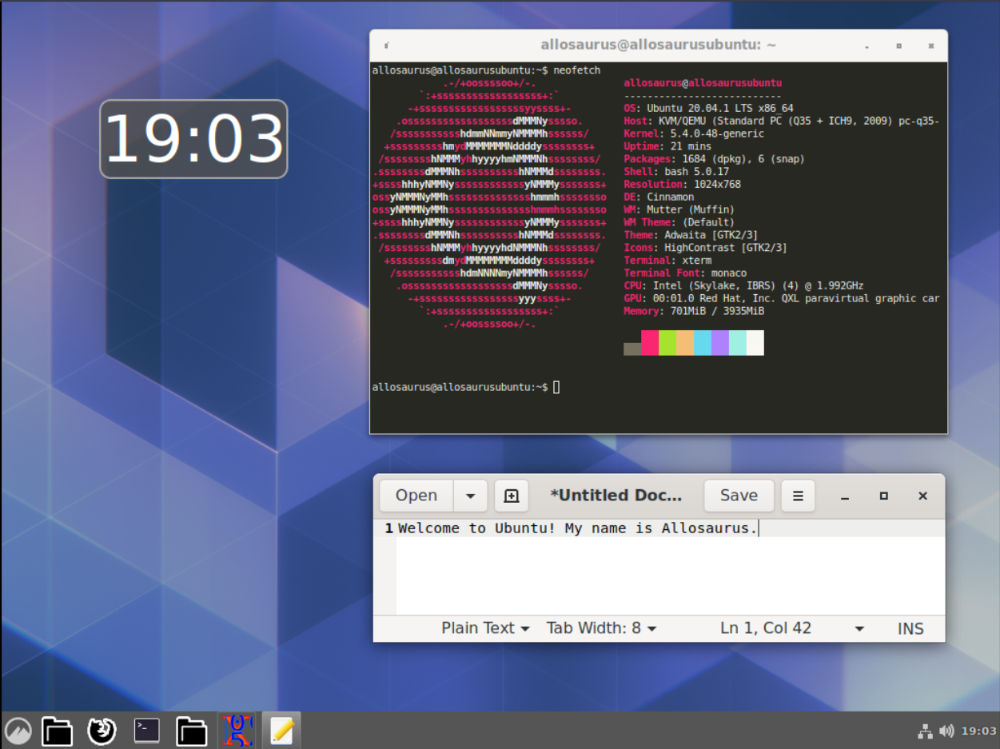

# 第二部分 - 初探 Linux
>  *这是大题的**第二部分**。*
>
>  *请**仔细**阅读完**所有**文章后，再按照内容指示、依据自身知识、参阅相关文档等，回答问题。*

恭喜，你已经完成了Linux的安装 (kind of) ，正式踏入了 Linux 的世界！接下来，就让我们一起来探索 Linux 吧。

完成了上一部分的你，应该已经知道终端 (Terminal) 在哪了，再次将它打开。这里就假设读者已经具备找到终端，打开终端，输入命令的能力。  
## 用户手册 (Man page)

如果你好好阅读完第一部分，你会知道其实在 Linux 中的命令都是一个个的小程序，因此他们自然也有自己的“文档” ，那么在哪里可以找到文档呢？此时我们就要使用指令`man`了。

### `man`

它是 manual 的缩写，在 Linux 中，多数常用的命令（尤其是 Unix 命令）的文档会被以一种特殊的格式写成，方便使用者以 `man` 指令查看它的文档，而`man`的可不仅仅可以查看命令，它还可以系统中的函数、特殊文件等。用法为：

```shell
man [command]
```

> ***Hint**: 如果对于以下提到的命令有哪个地方还不是很懂或者想了解更多，请参阅 Linux man pages ，也就是使用命令`man [command]` ，例如，如果对 `cd` 这个命令不太懂，就在终端输入`man cd` 。*


## Unix Shell

*Shell* 是 Unix 系统下用户与计算机服务交互的界面，当一个用户登入 Linux 时，一个Shell 会自动启动，并用那个 Shell 去运行其他程序，称为 *Login Shell* 。而当你打开终端时，你已经登入了，此时在终端打开的 Shell 称为 *non-Login Shell* 。

你可以在 Shell 中执行许许多多的命令，也可以撰写*脚本 (Script, 第三部分会特别提到 )* 。

Shell 有各种不同的实现，而目前较为常见的 Shell 有 `bash(Bourne Again Shell)` / `zsh(Z shell)` / `dash(Debian Almquist shell)` 等，而 Ubuntu 的系统预设 Shell 是 `dash` ，用户的预设 Shell 是 `bash`。

### 环境变量 (environment variable)

每个用户的 Shell 都有许许多多的*环境变量*，这些变量可以被程序读取，来影响一个程序。常见的环境变量有：

* `$HOME`

  存放用户的家目录。

* `$SHELL`

  存放用户使用的 Shell。

* `$PWD`

  存放用户当前的目录。

* `$PATH`

  存放用户命令的路径。

* `$EDITOR`

  存放用户希望使用的编辑器。

* `$LANG`

  存放用户的语言设置。

* ......

#### `echo`

这个命令其实很简单，就是输出一个字符串（或许你可能觉得它有点鸡肋）。但对于查看变量非常好用，因为在 Shell 中变量会被它的值取代，如果使用`echo` ，我们就可以知道变量的值到底是什么。

```shell
echo [STRING] # 输出 [STRING]
```

例如你可以直接在 Shell 中输入`echo $PATH` 来查看`$PATH`的值。


环境变量可以直接赋值：

```shell
MY_VALUE=233
echo $MY_VALUE
```

你会得到`233` 这个结果。

我们可以使用一个文件记录环境变量的赋值，或在记录启动 Shell 前运行的其他程序，这个文件称为 Shell 的配置文件，Shell 在运行前必定会读取这个文件，被 Login Shell 读取的又称为`profile` ，non-Login Shell 读取的又称为 `rc` 。  

每个 Shell 可以有自己的配置文件 ，如 `bash` 有 `bash_profile` / `bashrc` 等，`zsh` 有 `zprofile` / `zshrc`等，分别代表在 Login 和 non-Login 方式启动时读取。


#### `source`

如果你想让 Shell 重新读取配置文件，可以使用这个命令：

```shell
source FILE # 让读取 (evaluate) FILE 
. FILE # 跟上面的同义
```


如果你想定义一个变量`MY_VALUE=233` ，你可以直接在 Shell 中输入`MY_VALUE=233` ，但是`MY_VALUE` 的有效范围仅限于当前的 Shell 进程，也就是如果你把你的终端杀掉再重开，你就找不到`MY_VALUE`了 。

#### 问题 2-1 简答题

定义一个变量`MY_VALUE=233 `，并查看它的值。在终端中输入`sh` （这个命令的意思是执行当前用户的 Shell），再次查看`MY_VALUE `的值，两者的值还一样吗？为什么？

#### 问题 2-2 简答题

承上题，如果我想让两者的值一样呢？有什么其他命令可以定义`MY_VALUE` ？说明你的方法，并指出由它定义的变量作用范围。

>  ***Hint**: `man export`*

#### 问题 2-3 上传题

（请阅读完所有文章再回来作答）

承上题，按照阅读的文本和上述两题的理解，你知道如何才能正确配置自己的 `profile` 或 `rc` 文件了吗？请搜索相关内容，并上传你的配置文件。

> ***Tips:*** 像 *profile* / *rc* 再加上程序的配置文件，英语统称为 `dotfiles` ，因为通常我们会使它们在文件系统中不可见（ 前面加上`.` ），因此你可以在网上或代码仓库搜索 `dotfiles` ，可以看到不少别人的配置文件。

#### 补充 - Shells

对于*交互式 Shell （ 通常指你在终端使用的 Shell ）*  的选择，我们通常会选择使用上相对方便的 Shell ，`dash` 虽然速度非常快，但对于我们在写脚本或执行复杂命令的时候，`dash` 的可用语法功能太少了（对此 ，可以阅读什么是`POSIX Shell`），因此目前最为广泛的用户预设 Shell 通常是 `bash` 或`zsh` ，因为它们有较多额外便利的语法功能，近几年也有一个针对新手设计的 Shell ------ `fish` ，提供了命令补全等功能，有兴趣者可参阅。

### 用户 (User)

第一部分有提到 Linux 是多用户系统，它可以让多个用户在同一时间登入，你可以用`whoami` 命令查看自己的用户名（虽然你已经知道了），而有一个特殊的用户称为 `root` ，它具有所有用户都不能比肩的最高地位，可以说是一个系统的真正管理员，在 Linux 中，权限的概念相当重要。

#### `sudo`

是 ***s**witch **u**ser **do*** 的缩写，使用这个命令，你可以其他系统中的用户的身份执行命令，**包含`root`** ，如果缺省用户参数，那么就切换成 `root` 。

```shell
sudo [-u user] [command]
```

例如`sudo whoami` ，输出结果为`root`。但`sudo`也不是人人都可使用，能使用的用户必须被列在`/etc/sudoers`的文件中才行，且能切换的用户也会被限制 ，而你在安装 Ubuntu 时，Ubuntu Installer 已经自动帮你做好这个工作了，因此你可以使用`sudo` 。

#### `useradd` /`adduser`

新建用户，如果你不是`root` ，需要`sudo` 。

```shell
sudo useradd [user] # 无密码新建用户 [user]
```

#### `passwd`

修改用户密码，如果你不是`root` ，需要`sudo` 。

```shell
sudo passwd [user] # 修改 [user] 密码 
```


#### 问题 2-4 简答题

（强烈建议你先看完所有第二部分的文章后再回来做。）

新建一个用户 `dino` ，并让`dino`可以使用`root` 的身份执行命令，但不能用你的，列出你所使用的命令。 

>  ***Hint**: `sudoedit /etc/sudoers`*

#### 问题 2-5 简答+上传题

（强烈建议你先看完所有第二部分的文章后再回来做。）

由于在 Linux 中，权限的概念非常重要，拥有用户身份的不只是我们**人类用户**而已，一些程序也具有用户身份，请你调查 `/etc/passwd` 文件，说明里面每行字符串所代表的含义，并修改自己的 Shell 。

改完后重启系统，在终端中查看 `$SHELL` 的值，并将结果截图（ 要包含你查看`$SHELL`的命令 ）。

>  ***Hint**: 记得确保修改后的 shell 已经安装在系统中。*


## 包与包管理器 (Package and Package manager)

在 Linux 的生态系中，安装软件可不只是到网站上去下载安装包，解压缩后跑一个安装程序这么简单（事实上，这种安装软件的方式相当不安全，由于缺少验证，用户较容易下载到有心人士的恶意软件）， Linux 中大多数获得软件的途径是官方的*软件仓库 (repository, repo)* ，或其他经过授权的仓库，我们把这些软件称为*包*，而且通常会搭配*包管理器*一同使用。

一个包除了有软件本身外，还有特殊的说明文件，好让包管理器知道软件的信息，小部件该安装到哪里，如何管理它等，每个包管理器的说明文件也不大相同，因此通常会规定一个特殊后缀来命名这些包，代表一个适合某包管理器的软件包，如：`.deb` 适合`dpkg` ，`.rpm` 适合 `rpm` 等。

前面我们提到，一个完整的 Linux 系统肯定少不了包管理器，Ubuntu 的包管理器是 `dpkg` ，但大多数人在使用时会搭配另一个命令 ------ `apt` 使用（ `apt` 又称包管理器前端 (*frontend*) ）。由于读者在第一部分已经使用过 `apt` 安装了 `neofetch` 了，这边就不再多赘述命令：

* `apt install`

  安装

* `apt update`

  更新

* `apt upgrade `

  升级

* `apt search`

  搜索

* 请读者自行发掘更多命令。

#### 问题 2-6 简答题

*依赖 (dependency)* 在计算机中指一个软件需要另一个软件存在才能运行或使用的情形（因为它可能用到了那个软件的功能），现在请你访问 [Ubuntu packages](https://packages.ubuntu.com) ，查找并安装`xterm` 这个包，说明它是个什么用途的软件，并列出它依赖的其他软件包。

#### 问题 2-7 简答题

在 Ubuntu 中有没有非开源软件呢？请你了解并说明以下几个Ubuntu 软件仓库的区别，并为每个仓库各举出一个软件包的例子。

* Main
* Universe
* Multiverse
* Restricted
* Partner

#### 补充 - Linux 的更新

根据发行版的实践不同，不同的 Linux 发行版也有不同的更新方法，但这些方法可以大致分为两大方向：*LTS* 和 *Rolling Release* 。

前者为 *Long Term Support* 的缩写，你可能比较熟悉，以这种方式更新的发行版通常会有明显的版本，且每个版本有自己的生命周期，过了时间后你就无法得到相对应的支援或协助，新发现的臭虫也不会补丁，说白点就是彻底抛弃了这个版本。且对于系统本身的重要部件（如内核、驱动、库等），如果你没有到特别到指定仓库下载该软件的话，它也不会是最新的版本，而是经过系统开发者团队核可的，相对稳定的版本，每个版本在释出前也经过测试，因此整个系统也相对稳定。

采用与之相对的 *Rolling Release* 方法的发行版就没有明显的版本编号，当某软件释出了最新版本，只要开发者团队核可，官方仓库中对应的该软件就会更新，因此这种发行版没有大规模的更新，更新被拆分，分布在较小的时间尺度内，如果你使用这种发行版，你可以天天更新系统（你没听错），采用这种方法的优点是用户可以抢先使用最新版的软件，已知臭虫也能经过马上更新软件修复，缺点就是十分不稳定，更新的软件没经过测试，甚至与旧软件共存，可能会影响软件彼此的依赖关系，导致系统崩溃。

Ubuntu （笔者撰文时出到 20.10 ）就是以半年为一小周期（更新），两年一大周期（新版本）的 [LTS](https://wiki.ubuntu.com/LTS) 方式。那你可能会问，Ubuntu 是否可以使用后者的更新方法，目前 Canonical 并没有提供 Rolling Release 的 Ubuntu 支持，不过有用户搞了个[很有意思的东西](https://github.com/wimpysworld/rolling-rhino)，有兴趣者可深入研究。


##  文件与文件系统 (File and File system)

在 Linux 的文件系统中，一个文件可以使用这样的方法描述它的路径：`/directory1/directory2/myfile`。

如果你乖乖按照题目的指示来的话，在终端中，你目前所在的位置应该是*家目录*，也就是`/home/yourusername`下，一般在shell中会显示为`~` 。还有一个相当重要的目录`/` ，又称为根目录，Linux 中的所有文件都在根目录底下，你可以看到根目录有以下文件夹：

### 重要目录

* `/bin` / `/sbin`

  代表 *binary* ，含有系统中的*二进制文件 (binaries)* ，也就是你的程序，前面多加个`s` 文件夹代表通常只有管理员才能使用的程序。

* `/dev`

  代表 *device* ，含有装置，在系统启动时生成。

* `/etc`

  代表 *et cetera* ，即其他等等，会取这个名字是因为当时的系统管理员有些文件不知道放哪，干脆索性放这里。目前大多数程序的系统配置文件都会放这。

* `/home`

  前面提到的家目录，底下有用户的专属文件夹。

* `/lib`

  代表 *library* ，放软件库的地方。

* `/media`

  通常是外部存储空间，如固态硬盘、U盘等挂载的地方。

* `/usr`

  代表 *user* ，是原本用户文件夹在的地方，但现在有`/home` 了，这个文件夹用不太到，所以现在是大杂烩。

* `/tmp`

  代表 *temporary* ，放置暂时文件，任何用户都可以随意在这里新增文件，但一关机便会被销毁。


其他文件夹如`/sys` / `/run` / `/boot` 等并非不重要，而是已经超过了本文适合新手的范畴，而且在这几个文件夹底下的文件最好不要随便操作，可能导致无法挽回的后果。

以下介绍两个命令：`cd` 和`ls` 。这两个命令可以说是 Linux 使用者最常使用的命令了。

### `cd`

是 *change directory* 的首字母缩写，这个命令可以让我们切换当前所在文件夹，它最简单的用法为：

```shell
cd [directory]
```

现在，请你`cd` 进 `probleam-set-1` 底下的`attachment/` 。

### `ls`

是 list 的缩写，这个命令可以让我们列出文件夹中所含的内容，它最简单的用法为：

```shell
ls # 列出当前目录下的文件
ls [directory] # 列出所选文件夹下的文件
ls -l # 列出当前目录的详细信息
ls -a # 列出包含隐藏文件的所有文件
```

这四个命令相当重要，请你各运行一次，看看他们给出怎么样不同的结果。

> ***Tips**: 隐藏文件指的是文件名前带`.`的文件。*

当你执行`ls` 时，你会发现它不只列出了文件，还列出了文件夹！没错，第一部分提到 Unix 的特色就是将任何事物当成文件，因此，文件夹在 Linux 的文件系统中，其实也被视为文件，只是有不同属性罢了。

而当你执行`ls -a` 时，会发现多了两个神秘的文件，他们分别是`.` 和 `..` ，而这两个文件是由文件系统生成的，分别代表*当前目录* 和*上级目录* 的文件，听着很神奇，不是吗？ 

####  问题 2-8 简答题

请你举一反三，推测并说明回到当前目录上`n`层目录的命令。

#### 问题 2-9 简答题

执行`ls -a` 时，列出目录有点笨笨的，如果我只想列出隐藏文件呢？(***Hint**: 查阅 man page*)

#### 问题 2-10 简答+上传题

在 Linux 中，带有`*` 符号的表达式具有特殊意义，它代表匹配所有值，`ls`也可以以如下方式使用：

```shell
ls p*
```

指列出所有以 *p* 开头的文件。请你以命令列出所有在`/etc` 目录下，所有以`.conf` 结尾的文件，上传截屏，并说明你的方法。

### 其他命令

现在来介绍其他常用的文件操作相关命令： 

### `touch`

```shell
touch FILE
```

新建文件，其实 `touch` 一开始并不是拿来新建文件的，而是拿来修改文件的*时间戳 (Timestamp)* ，但`touch` 在参数中的文件并不存在时会新建这个文件，而这个功能实在是太方便了，因此它渐渐成为了新建文件的代表命令。 

### `mkdir`

```shell
mkdir DIRECTORY # 新建名为 DIRECTORY 的文件夹
mkdir -p DIRECTORY # 递归新建文件夹
```

新建文件夹 ，加上参数 `-p` 可以递归新建多个文件夹并保留原本已经存在的文件夹，如：

```shell
mkdir -p existingdir/newdir1/newdir2 # 递归新建文件夹 newdir1 和 newdir2
```

#### `mv`

移动文件

```shell
mv FILE DIRECTORY # 将文件 FILE 移到 DIRECTORY 底下
```

#### `cp`

拷贝文件

```shell
cp FILE1 FILE2 # 拷贝文件 FILE1 到 FILE2
```

#### `rm`

移除文件，使用时需注意。

```shell
rm FILE # 移除单个文件 FILE
rm -r DIRECTORY # 递归移除文件夹 DIRECTORY 及其内容
```

### 权限 (Permission)

现在让我们仔细研究下`ls -l` 后的结果。

```shell
-rw-r--r-- 1 allosaurus users 5916  9月 24 00:00 I-love-unix.txt
-rw-r--r-- 1 allosaurus users  483  9月 24 00:00 terminal-monokai-dark-theme.txt
```

结果以一种固定的格式排列着，按列由左至右分别是：*权限 (Permission)* 、*拥有者 (User)* 、*用户组 (Group)* 、*估计大小 (Size)* 、*修改时间 (Modified time)* 、*文件名 (Filename)* ，其中权限是一串奇怪的字符，`-rw-r--r--` 。

在 Linux 文件系统中，每个文件都有自己的权限，我们可以一串字符，方便地描述这个权限，以`-rwxrw-r--` ，共 10 个字符为例：

* 第一个字符`-`

  第一个字符代表的含义是这个文件的*类型 (type)* 。`-`代表这个文件是普通文件，`d` 代表这个文件是文件夹，`l` 是个链接等。

* `rwx` / `rw-` / `r--` 

  后面的九个字符每三个字符为一组，每一组代表一类用户的权限，由左至右分别为拥有者、相同用户组、公开（其他人）的权限，而三个字符分别代表读 (`r`) ，写 (`w`) ，运行 (`x`) ，如果当前字符显示`-`代表没有那个权限。

  方便起见，我们也可以以二的倍数描述四个字符`r`/`w`/`x`/`-` ，其中 `r = 4, w = 2, x = 1, - = 0` ，所以一种权限`rwx`可以表达为`4+2+1=7` ，而另一种权限`r-x`可以表达为 `4+0+1=5` ，一组权限`rwxrw-r--`可以记作`764` 。

#### `chmod`

修改一个文件的权限，如果一个文件的拥有者是`root`，通常搭配`sudo` 一起使用。

```shell
chmod MODE FILE # 修改 File 为 Mode 权限，你自己必须是拥有者。
sudo MODE FILE # 修改 File 为 Mode 权限，拥有者为 root 。
```

其中的 `MODE` 可以是我们刚才提到的权限数字表达式 ，也可以是其他形式（问题 2-12 ） 。

例如，当你想把一个文件 `myfile` 改为仅拥有者可改、读、执行，其他人只能读和执行时，你可以这么使用：

```shell
chmod 755 myfile
```


#### 问题 2-11 简答题

*Everything is a file.*  `/dev` 底下的几个文件其实代表者你的装置，请你`ls -l` ，观察这些装置的文件类型，这些文件类型又代表了什么呢？试说明。

#### 问题 2-12 上传题

* 请你新建文件`myexefile` ，并将它的权限改为`-rw-r--r--` 。

* 每次都要计算二进位很烦 ，有没有更方便的方法？

  请你调查：

  ```shell
  chmod u+x myexefile
  ```

  所代表的含义，并使用这种 `MODE` 表达方式，将这种权限更动套用到其他类用户的权限上。最后截屏上传`myexefile` 的权限。

#### 补充 - 挂载

***挂载 (mount)***  是 Linux 文件系统中非常重要的一个概念，限于篇幅，笔者无法在这着墨更多，且由于目前桌面环境的发达，新手在使用 Linux 时已经不需顾虑挂载问题便可使用移动装置，当然，如果你必须在命令行中操作这些硬件设备，那么你必须理解这个概念。请自行调查`/etc/fstab` 文件 ，`mount` 命令等。


## 文字编辑器 (Text Editor)

在 Linux 上的编辑器可说是不胜枚举，有相当著名的 `vi/vim` ,  `emacs` ，简单易用的 `nano` ，还有古老的`ed`[~~(*ed is the standard text editor.*)~~](https://wiki.c2.com/?EdIsTheStandardTextEditor) 身为一个 Linux 使用者，如果你觉得`VScode/Atom/SublimeText` 等编辑器的功能太过花花绿绿，只是想改个配置文件时，前面所提的编辑器就可以派上用场啦！限于篇幅原因，以下仅介绍`vim` ，笔者~~(`emacs` 用户)~~也推荐每个 Linux 使用者*学习*`vim` ，因为它完全可以在终端中使用，功能强大，而且类似`vi`的快捷键被应用在不少程序上，在服务器等环境会相对方便。


> *Left: Vim icon. Right: I have no idea what this is.*

*Vim* 是 Vi improved 的意思，它的目标是在另一个编辑器`vi`的基础上，在终端中提供程序员更好的编程体验。你大概率已经有 Vim 在你的系统中了，你可以用`vim --version` 来确认。

当你进入 Vim 时，你会发现你无法输入任何的文字，这是非常正常的，如果你想要执行插入、取代等动作，需要输入规定的字符。

请`cd` 到 `problem-set-1` ，并用`vim I-love-unix.txt` ，在Vim 中打开`I-love-unix.txt`。
### 移动
#### `j`/`k`/`h`/`l`

分别对应上下左右移动，当然你也可以用键盘上的上下左右键（但那样很没有效率，你不认为吗？）

#### `0`/ `$` /`gg` / `G`

`0`到行首，`$`到行末，`gg`可以让你移到文件开头，`G`可以让你移到文件尾部。

如果要跳到某一行，可以使用`nG`，其中`n`为行号，如`3G`。

### 离开 / 写入

#### `q` / `q!`

quit ，离开 Vim 。如果加上感叹号就是强制离开。

#### `w`

write ，将当前内容写入文件，说白话一点就是存档的意思。

学会了存档和离开的方法，接着我们试着来编辑这个文件。

在 Vim 中，你可以合并多个命令，例如 `wq` 的意思就是写入并退出。

### 模式 (Mode)

Vim 有 以下几个常用的模式：

* Normal Mode

  大多数的 Vim 命令都在这个模式下执行，如果没有额外配置，一进入 Vim 中所使用的模式就是 Normal Mode 。

* Insert Mode

  在 Normal Mode 中按下 `i` 进入，在这个模式中你可以在光标前任意插入字符。

* Replace Mode

  在 Normal Mode 中按下`R` 进入，在这个模式中你可以替换光标后的字符。

* Visual Mode

  在 Normal Mode 中按下 `v` 进入，有点类似 Normal Mode ，但在移动时的移动范围会被选取起来。

#### `ESC`

离开当前 Mode 。

### Cut, Copy and Paste

#### `d` / `y` /`p` / `P`

搭配 `Visual-mode` 一起使用，选取一些字符后，按下`d` ，可以切下当前的选取区域，也可以搭配 `normal-mode` 使用，`dd` 切下当前行，或`ndd`，其中`n` 代表切下的行数，如：`2dd`。

其中如果把`d` 替换成`y` 的话，就不会执行切下功能，而是拷贝。

最后在 `normal-mode `中按`p`在光标前贴上或按`P`在光标后贴上。

特别地，`dG `有切下文件所有内容的功能。

### Command

#### `:`

在 Vim 中运行 Vim 的命令 ( 没错，Vim 也有命令 ) ，例如，你可以输入 `:set number` 让 Vim 显示行号。

### Find

#### `/` / `n` / `N`

按`/` 输入想要的字符串，字符串可能在文件中多次出现，此时你可以按`n` 跳到它下次出现的地方，或按`N` 跳到上次出现的地方。

> ***Hint:** 命令记不住？ 不要紧张，你随时可以在 Vim 中输入 `:h` 来查看命令，你也可以在 Shell 中执行`vimtutor`来继续学习 Vim。*

#### 问题 2-13 上传题

请你编辑 `I-love-unix.txt`，把里面的`unix` 全部改成 `linux` ，并将它重新命名为 `I-love-linux.txt` (***Hint**: 你可能会用到 `mv` 这个命令*)。然后将这个文件上传。

#### 问题 2-14 上传题

Vim 是一个高度客制化的编辑器，请你配置自己的 Vim ，让下次进入 Vim 时，Vim 能显示行号，而不用每次都输入`:set number` 。（注意，不需依靠补充即可达成，不过鼓励读者参考补充客制自己的 Vim ），上传自己的*Vim 配置文件* 。

#### 补充 - Vim plugins

嫌 Vim 功能太少？用户可以自行为 Vim 写新插件，只要你懂得一些 C 语言和 Vim script 。或者现在已经有很多别人写好的插件了，你可以参考[这里](https://vimawesome.com/)看有哪些插件。

## 图形环境与X (Grapical environment and X) 

现代用户在使用电脑时，肯定少不了图形环境，熟悉命令的用户可能会觉得命令行方便很多，但对大多数电脑使用者来说，他们可能记不熟命令，或只是把电脑当成一个*浏览器开启平台* ，或者觉得命令行太丑没有美感，不够人性化等，因此图形环境在 Linux 也是近年来相当重要的一环。那么在 Linux 中，怎么实现一个图形环境呢？

在 Linux 系统中，图形化的工作交给一个服务器，它负责处理用户在图形界面中与系统的交互，我们把这个服务器成为*图形服务器 (display server)* ，而与这个服务器对话的方式也是有规范的，我们把规范称为*协议 (protocol)* ，而 X 就是目前 Linux 中使用的最广泛的图形服务器协议，它所实现的图形服务器又称为 *X server* 。X 已经是个历史相当久远的协议了，目前新生的其他协议还有 *Wayland* 等，但多数新协议不是不稳定就是支援的图形软件不足，因此 X 仍旧是主流。

当我们有了一个图形服务器后，我们就可以将用户在图形环境中所有可能的操作拆分，让不同软件与服务器交互后负责，例如软件的视窗的新建、移动和销毁由*窗口管理器 ( window manager )* 负责，复杂的用户的输入活动（如东亚文字输入）由*输入法 (Input method)* 负责，图形化管理文件有*文件管理器 (File manager)* 负责，还有你的终端 等，当我们需要进行某些操作时，便下载相对应的软件，配置后使用。

#### 问题 2-15 上传题

你知道你也能选择跟配置自己想用的终端吗？现在就让我们来尝试一下，并练习 X 的配置吧！

* 首先确认系统中安装了`xterm` ，如果没有则安装。

* 用户可以通过编辑`~/.Xresources`文件 的方式配置使用了 X 的程序，迅猛龙同学为你提供了一份终端色彩主题`attachments/terminal-monokai-dark-theme.txt`，请你不要辜负他的好意，参考他为你提供的主题，配置自己的`xterm` 的色彩主题。可以参考[Xresource syntax](https://wiki.archlinux.org/index.php/X_resources#Xresources_syntax) 和 `man xterm` 。

* `xrdb -merge .Xresources` 套用，最后上传自己的 `~/.Xresources` 。

  > ***Hint**: man page 只要看 Resource 那部分就可以了。*

  

### 桌面环境

读者可能会想：“那么你的意思是我一定得一个个下载每个我需要的软件吗？这也铽麻烦了，而且我也不知道我需要什么啊。” 

其实 Linux 的特色就是给用户选择的权利，你当然可以按照笔者上面说的，自定义所有操作所用的软件，不过的确有很多人不堪其扰，因此 *桌面环境 (Desktop environment)* 便应运而生，它是上述那些图形软件的集大成者，范围涵盖一个用户使用电脑可能会用到的所有软件，当然也包含了不少你想都没想过的软件。

现在较为有名的 Linux 桌面有 *Gnome* / *KDE* / *Cinnamon* 等（可参考第一部分的图），而在Ubuntu 中，预设的桌面是 Unity ，每个桌面特色和长相也不尽相同，在 Linux 中，你可以任意替换你想要的桌面。

#### 问题 2-16 上传题

（请读者先做完第二部分其他题目。）

在 Unix 世界中，有个黑话叫做 *Rising* ，指客制自己图形环境的行为，详情可以搜索。

因此本题又名为 *Baby Rising* ，用来作为第二部分的结尾正好：）。共分三部分：

* 请你调查在 Ubuntu 中切换桌面环境的方法，撤换 Ubuntu 原本的桌面环境，并装饰一下你的桌面环境（如改掉桌面颜色、壁纸，添加桌面小工具等）

* 在改过色彩主题的 `xterm`（先前的题目） 中使用 `neofetch` 。

* 截屏整个桌面（包含你的 `xterm` ），并上传截屏，本题就完成了。



## 结尾

恭喜，你已经成为初级 Linux 用户了！

事实上，第二部分全部内容即便你不知道，由于桌面环境的进步，大多数时间里，你还是可以在 Linux 中活得好好的 *~~(Install Linux on grandma's computer)~~*，例如拿 Ubuntu + Unity 桌面举例：

* 几乎所有你平时所需的软件都有图形界面。
* 系统设定有图形界面。
* 就算是更新软件也有个图形界面，系统也会提醒你更新，你唯一要做的只是输密码。

但有时我们的确会碰上一些无图形界面可用的情况，例如管理远端主机~~(no vnc)~~ ，而且如果你真的遇到一些纯用鼠标点击无法解决的问题时，即便大家都很乐意帮忙，但是用户基数毕竟少，你很难找到或马上找到能帮你解决问题的人，如果能自行解决问题，那就最好不过了，这也是为什么会有第二部分的原因。阅读完本部分，即便你可能还是不懂一些名词（本文也没有涵盖全部内容），但至少你知道往哪个方向搜索了，找到解答的概率就更大了，这对于学习就是相当不错的跃进。

> ***Tips:** 查找 Linux 名词或软件最好的方法就是到官方的 wiki 或文档搜索，但很不幸的，很多发行版的文档不是不全，就是令人眼花缭乱，不适合新手（笔者认为 Ubuntu 的文档也有缺陷，进入官网后，新手甚至可能找不到文档和教程在哪），而 [Arch Wiki](wiki.archlinux.org) 是 Linux 社群中著名的 ，较完整且易读的文档（即便 archlinux 本身不适合新手），读者在考虑发行版差异下，可以参阅。*

下一步呢？第三部分是进阶使用者跟普通使用者的分水岭，不懂 Shell Script ，别说你精通 Linux ！

（二面题到这里结束。）

## 参阅

* [Ubuntu 20.04 Documentation](https://help.ubuntu.com/lts/ubuntu-help/index.html)

* [Ubuntu Wiki](https://help.ubuntu.com/community/CommunityHelpWiki)

* [Ubuntu Packages](https://packages.ubuntu.com/)

> ***Tips:** 对于新手来说，Ubuntu 网站记住这三个就好，因为你会被它的官方首页吓到。*

* [The Linux command line for beginner](https://ubuntu.com/tutorials/command-line-for-beginners#2-a-brief-history-lesson)

* [Debian Manual](https://www.debian.org/doc/manuals/debian-reference/)

* [Archlinux Wiki](https://wiki.archlinux.org/index.php)

* [Unix Tutorial for Beginners](http://www.ee.surrey.ac.uk/Teaching/Unix/)